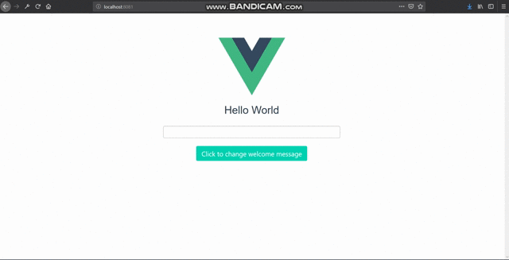

# Emit data in Vue.js: custom events

Emit data in Vue.js: custom events

## Getting Started
Make sure you have `npm` and `yarn` on your local machine

1. Clone this repository and cd into it
2. Run `yarn` or `npm install` to download dependencies
3. Execute `yarn run serve` to build project assets and run it in your browser
4. See the [tutorial](https://pusher.com/tutorials/data-visualization-vue-chart) for useful notes 

### Prerequisites

* Vue
* Vue-CLI
* npm or Yarn

## Built With

* [Vue](https://vuejs.org/) - A Great reactive Js framework
